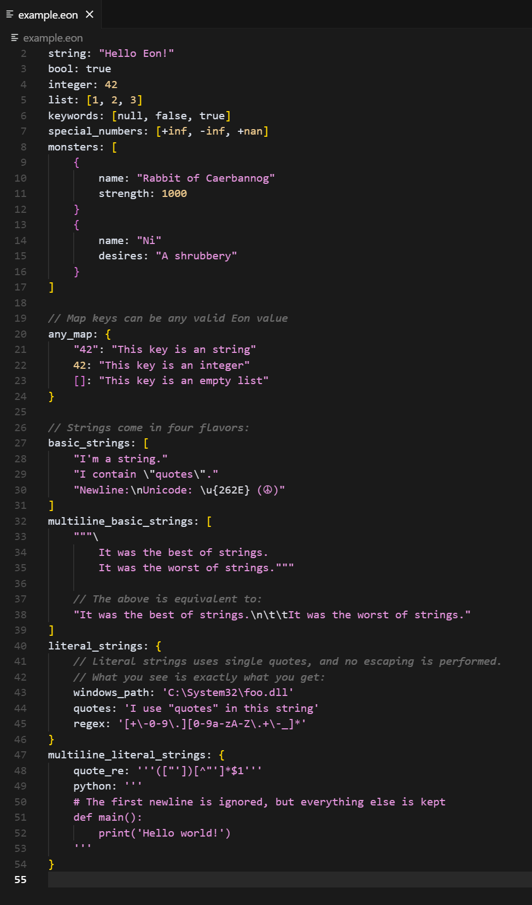

# Eon Support for VS Code

Primitive syntax highlighting for `.eon` files.

This extension aims to provide syntax highlighting for the [eon](https://github.com/emilk/eon) configuration language in Visual Studio Code.

 

## Installation

You can install this extension from the Visual Studio Code Marketplace (once it's published).

For local development:

1.  Clone this repository.
2.  Install `vsce` (the Visual Studio Code Extension manager): `npm install -g @vscode/vsce`.
3.  Package the extension: `vsce package`.
4.  Install the generated `.vsix` file in VS Code via `Extensions: Install from VSIX...` in the command palette.

## Contributing

Contributions are welcome! Please feel free to open an issue or submit a pull request.

## License

MIT

